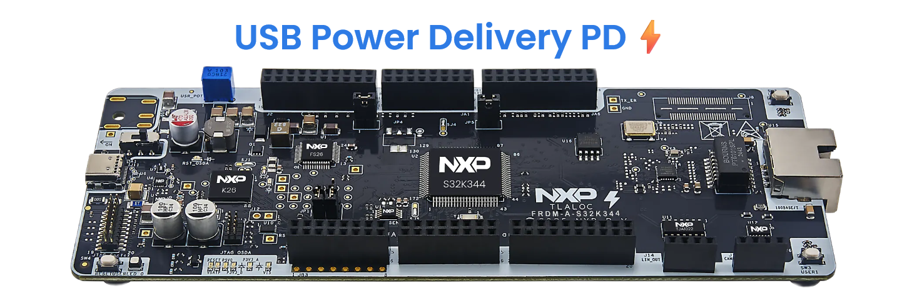
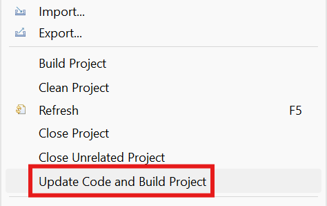

# NXP Application Code Hub
[](https://www.nxp.com)

## Power Delivery using FRDM-A-S32K344
This demo implements a programmable power-delivery system that uses a USB-C Power Delivery (USB-PD) interface to supply and control the operating voltage for an MCU. The design negotiates voltage profiles with a USB-C power source - such as 5 V, 9 V, 12 V - using the USB-PD protocol, and then configures the system's power path accordingly.
The FRDM-A-S32K344 board integrates the NXP [PTN5110](https://www.nxp.com/products/interfaces/usb-interfaces/usb-type-c/single-port-usb-pd-tcpc-phy-ic:PTN5110) USB-PD PHY, which the S32K344 MCU programs over I2C to negotiate the desired bus voltage - configured via the `BUS_VOLTAGE` macro (default: 9 V) - with the USB-C power source. The [NX20P3483UK](https://www.nxp.com/products/power-management/usb-c-protection-and-load-switches/vbus-protection/usb-pd-and-type-c-high-voltage-sink-source-combo-switch-with-protection:NX20P3483UK), a USB-PD and Type-C high-voltage sink/source combo switch with protection, then safely routes the negotiated voltage to power the board.
The project provides a modular firmware structure to manage PD negotiation, monitor power status, handle fault conditions, and reconfigure voltage levels as required by the application.
[<p></p>](./images/FRDM-A-S32K344_Power_Delivery.png)


#### Boards: FRDM-A-S32K344
#### Categories: Communication
#### Peripherals: Siul2, ADC, LPSPI, LPI2C
#### Toolchains: S32 Design Studio IDE

## Table of Contents
1. [Software and Tools](#step1)
2. [Hardware](#step2)
3. [Setup](#step3)
4. [Results](#step4)
5. [Support](#step5)
6. [Release Notes](#step6)

## 1. Software and Tools<a name="step1"></a>
This example was developed using the FRDM Automotive Bundle for S32K3. To download and install the complete software and tools ecosystem, use the following link:
- [S32K3 FRDM Automotive Board Installation Package](https://www.nxp.com/app-autopackagemgr/automotive-software-package-manager:AUTO-SW-PACKAGE-MANAGER?currentTab=0&selectedDevices=S32K3&applicationVersionID=156)

## 2. Hardware<a name="step2"></a>
### 2.1 Required Hardware
- Personal Computer
- USB Type-C cable
- Power Supply with USB-PD capabilities.
- [FRDM-A-S32K344](https://www.nxp.com/design/design-center/development-boards-and-designs/FRDM-A-S32K344)[<p align="center"></p>](https://www.nxp.com/assets/images/en/dev-board-image/FRDM-A-S32K344-TOP.png)

### 2.2 Debugger Connection
- Connect the USB Type-C cable to PC and FRDM-A-S32K312 board for power supply and debugging

## 3. Setup<a name="step3"></a>

### 3.1 Import the Project into S32 Design Studio IDE
1. Open S32 Design Studio IDE, in the Dashboard Panel, choose **Import project from Application Code Hub**.
   [<p></p>](./images/import_project_1.png)

2. Find the demo by searching: [dm-power-delivery-frdm-a-s32k344](https://mcuxpresso.nxp.com/appcodehub?search=dm-power-delivery-frdm-a-s32k344)
3. Open the project, click the **GitHub link**, S32 Design Studio IDE will automatically retrieve project attributes, then click **Next>**.
    [<p></p>](./images/import_project_3.png)

4. Select **main** branch and then click **Next>**.

5. Select your local path for the repo in **Destination->Directory:** window. The S32 Design Studio IDE will clone the repo into this path, click **Next>**.

6. Select **Import existing Eclipse projects** then click **Next>**.

7. Select the project in this repo (only one project in this repo) then click **Finish**.

### 3.2 Generating, Building and Running the Example
1. In Project Explorer, right-click the project and select **Update Code and Build Project**. This will generate the configuration (Pins, Clocks, Peripherals), update the source code and build the project using the active configuration (e.g. Debug_FLASH).
   Make sure the build completes successfully and the *.elf file is generated without errors.
   [<p></p>](./images/UpdateCodeAndBuildProject.png)
   Press **Yes** in the **SDK Component Management** pop-up window to continue.

2. Go to **Debug** and select **Debug Configurations**. There will be a debug configuration for this project:
[<p></p>](./images/DebugConfigurations.png)

        Configuration Name                  Description
        -------------------------------     -----------------------
        $(example)_debug_flash_pemicro      Debug the FLASH configuration using PEmicro probe

    Select the desired debug configuration and click on **Debug**. Now the perspective will change to the **Debug Perspective**.
    Use the controls to manage the program flow.

## 4. Results<a name="step4"></a>
When the board is connected, there will be a negotiation between the MCU and the charger to set the MCU voltage to the requested value specified on the macro as mentioned on the description section. When the voltage is correctly set on the MCU, the on-board LED will turn green, in case the voltage was not correctly set, the LED will turn red.

The following macro can be changed to choose a different bus voltage. The desired voltage needs to be entered in millivolts.
```c
/* Bus Voltage */
#define BUS_VOLTAGE 		(9000U)     /* 9000mV = 9 volts */ 
```
[<p></p>](./images/Results_Power_Delivery.gif)

In the GIF above we can see that the negotiated voltage from FRDM-A-S32K344 was 9 Volts, according to the macro BUS_VOLTAGE.


## 5. Support<a name="step5"></a>
For general technical questions related to NXP microcontrollers, please use the *[NXP Community Forum](https://community.nxp.com/)*.
#### Project Metadata

<!----- Boards ----->
[]()

<!----- Peripherals ----->
[]()
[]()
[]()
[]()

<!----- Toolchains ----->
[](https://mcuxpresso.nxp.com/appcodehub?toolchain=s32_design_studio_ide)

Questions regarding the content/correctness of this example can be entered as Issues within this GitHub repository.

>**Warning**: For more general technical questions regarding NXP Microcontrollers and the difference in expected functionality, enter your questions on the [NXP Community Forum](https://community.nxp.com/)

[](https://www.youtube.com/NXP_Semiconductors)
[](https://www.linkedin.com/company/nxp-semiconductors)
[](https://www.facebook.com/nxpsemi/)
[](https://x.com/NXP)


## 6. Release Notes<a name="step6"></a>
| Version | Description / Update                           | Date                        |
|:-------:|------------------------------------------------|----------------------------:|
| 1.0     | Initial release on Application Code Hub        |February 16<sup>th</sup> 2026|
